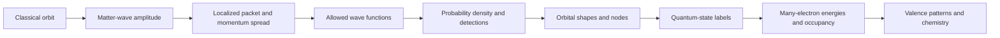

# Part 2 architecture

The film asks one question — **if the classical orbit is gone, what describes an electron in an atom?** — and every
major teaching object becomes the input to the next section.

## Project layout

- `config.py` — 16:9 canvas, the palette and what each colour means, the chapter registry, narration windows, review speed.
- `main.py` — the scene catalogue and the CLI: list, preview, scene, render, review.
- `manim_scenes/common.py` — `QuantumScene` plus the whole visual vocabulary: typography, glow primitives, background, the cast, waves, calculated orbitals, box diagrams, the periodic table, and the chapter-specific set pieces — `bohr_shell_atom` (chapters 3 and 16), `double_slit_rig` / `two_slit_probability` (5), `scale_ruler` (4), `radial_plot` (11 and 13), `house` / `street` (12), `madelung_rows` / `diagonal_chart` (17).
- `manim_scenes/atomic_visuals.py` — shared camera-aware lighting for the classical markers in the opening and experimental recap.
- `manim_scenes/scene_01_…py` … `scene_19_…py` — each exposes `play_scene(scene)` plus a standalone class.
- `manim_scenes/full_video.py` — runs every chapter function on one `QuantumScene`.
- `utils/physics_models.py` — normalized hydrogen radial functions, the radial distribution `r^2 R^2` and its peak, the real angular basis, probability samples, shading-ready isosurfaces, Gaussian uncertainty, occupancy, and the Madelung `(n + l)` ordering.
- `utils/quantum_examples.py` — the SI worked examples, and Bohr's own radius, speed and momentum, which chapter 3 banks and chapters 4, 6, 7, 11 and 12 spend.
- `utils/audit.py` — numerical invariants, narration order and rates, animation timing, text bounds and collisions, optional rendered storyboards.
- `utils/visual_preview.py` — a short motion review of the spine, unsynchronised to narration.
- `narration_script.md` — the sole editable source of spoken narration; `utils/narration_export.py` derives the voice-ready text.

The sequel is self-contained. It shares Part 1's palette and conventions but does not import Part 1's `config`
or the repository's `themes` package, which avoids cross-project module collisions and keeps the folder
independently renderable. The Oceanic ground is rebuilt locally in `common.deep_field()`.

## The number bank

Chapter 3 is a deliberate structural device rather than a recap. It puts three Bohr quantities and a separate school capacity rule on screen —
`r_n = n^2 a0`, `E_n = -13.6/n^2 eV`, `v_n = alpha c / n` and the `2n^2` capacity — and each is consumed later:

| Number | Spent by | Result |
|---|---|---|
| `v_1` | chapter 4 | `lambda = h/(m v_1) = 3.3249 Å`, the size of an atom |
| `v_1`, `r_1` | chapter 6 | `lambda = 2*pi*r_1` identically, so `2*pi*r = n*lambda` **is** `m v r = n h / 2*pi` |
| `r_1`, `v_1` | chapter 7 | the classical trajectory claims exact position and momentum vectors; radius and speed alone do not |
| `r_1` | chapter 11 | the peak of `P(r) = r^2 R^2` |
| `2n^2` | chapter 12 | re-derived as `(1 + 3 + 5 + ...) x 2 = n^2 x 2` |

This is why `utils/quantum_examples.py` exposes `bohr_radius`, `bohr_speed` and `bohr_momentum` rather than hard
coding the rounded figures into the scenes: five chapters read the same values, and `utils/audit.py` asserts the
identity `lambda(v_1) / 2*pi*r_1 = 1` to nine significant figures. If that ever stops holding, chapter 6's
central claim has broken and the audit fails rather than the film quietly showing two different numbers.

## Continuity and lifetime

`QuantumScene.anchor` is the diagram currently carrying the argument. `morph()` transforms compatible curves and
unwraps a classical track into a wave; it crossfades heterogeneous groups and meshes at the same visual anchor.
`dissolve()` asks for that crossfade explicitly when the two representations have nothing in common. Avoiding
recursive group alignment keeps invisible copied geometry from accumulating over a 26-minute render.

The outgoing anchor survives `finish()`, so the next chapter transforms it instead of opening on a blank screen.
Standalone chapters start from an empty anchor and create the same incoming object.

Temporary material lives in `local`. Formulas and 3D captions use `pin()` to stay in screen coordinates, and
`drop()` completes the fade before releasing the fixed-camera attachment — releasing first would tilt the text
into the world for the length of the fade. `at(t)` aligns the next beat with a planned second inside the chapter
and raises if the choreography overruns. `finish()` clears temporary labels, holds the anchor to the planned
duration, and refuses to end a chapter that left anything visible outside the anchor.

## Depth sorting and the background

Manim's 3D camera sorts depth-sorted mobjects by distance and then draws everything else in front of them.
A flat background is everything else, so it hides an orbital completely. Rather than leaving that as a rule
to remember, surfaces carry a `_needs_depth_sort` flag and `morph`, `dissolve` and `show` lower the flat ground
before such an object arrives; `raise_ground` declines to restore it while one is still on stage. The 3D mote
field is genuinely three-dimensional and stays throughout, which is what gives a rotating shot its parallax.

## Numerical visual pipeline

1. Evaluate normalized hydrogen radial functions with generalized Laguerre polynomials.
2. Combine them with normalized real spherical harmonics. The integer used for real-basis indexing is **not** a direct assignment of `px` and `py` to magnetic eigenvalues, and the film says so on screen.
3. Square the amplitude on a finite Cartesian grid.
4. Find the isodensity threshold whose high-density cells contain approximately the requested probability fraction.
5. Extract triangles with marching cubes, then relax them with **Taubin smoothing** — alternating shrink and inflate passes. Plain Laplacian smoothing pinches the narrow neck between the lobes of a d state until the mesh tears, and the tear shows as background through the middle of the atom.
6. Compute area-weighted vertex normals and average them back onto each face, so a coarse mesh still reads as a curved surface.
7. Shade every face per frame from the live camera angle: wrap lighting, a specular term, a rim term, and two-sided treatment for faces turned away. Manim's own 3D shading is switched off for the whole film because it recolours a face from that face's own corner normals, which is right for a `Sphere` and wrong for a triangle soup.
8. For repeated 1s detections, sample the exact radial Gamma distribution and uniform directions. Other illustrative clouds use discretized density-weighted sampling with sub-cell jitter.
9. For planar maps, evaluate an explicitly labelled x–z slice, cropped to where the state actually lives and vignetted at the border so it does not read as a rectangle laid on the frame. Brightness is normalized per image and must not be compared between images.
10. For "how far from the nucleus" rather than "how dense here", integrate nothing and plot `P(r) = r^2 R_{n,l}(r)^2` directly. This is a different quantity from `|psi|^2` and the film draws both: the density of 1s is maximal at the nucleus while `P(r)` vanishes there, and `P(r)` peaks on `a_0`. The `4 pi r^2 |psi|^2` form is only correct for s states, so the code uses `r^2 R^2` throughout.

Previews use a 29-point grid per axis; full-resolution renders use 41. A displayed surface is a visualization of an
isodensity threshold, not a membrane; the finite grid, mesh resolution and probability truncation limit its precision.
Shape comparisons sometimes change display scale and do not provide calibrated atomic radii.

The Gaussian demonstration uses `sigma_p = hbar / (2 sigma_x)`, so both distributions change together, and its
equality is distinguished on screen from the general inequality. The packet curve shows a real amplitude component;
the momentum panel shows a distribution centred on its mean, with its peak height rescaled for readability. Compare
horizontal widths, not plotted areas.

## Visual grammar carried over from Part 1

- Deep navy ground with a faint grid and a slow bubble drift; restrained scaffolding.
- Cyan and lavender are the two signs of a real amplitude. The legend says explicitly that they are not charges.
- Probability-density maps use nonnegative brightness only.
- Gold marks the current question or quantity, green a confirmed or selected arrangement, coral a rejected one.
- Every glyph a viewer must read carries a background stroke in the ground colour, so text never dissolves into the art behind it.
- Formulas stay large. The plated treatment is reserved for three equations.
- Orbital boxes count occupancy. They are never presented as rooms or trajectories.

## Scientific boundaries

The progression is not a claim that every quantum postulate follows from uncertainty alone. Spin and fermionic
antisymmetry are additional structure, and chapter 14 says so. Aufbau is an organizing procedure for approximate
ground-state filling. Hund's preference reflects many-electron energetics and symmetry. The exact atom is a joint
many-electron state, not a set of identifiable miniature particles in independent clouds.

The ring and the string are labelled analogies on screen. No circular matter wave is presented as the actual
three-dimensional hydrogen solution. `4s → 3d` appears as a common neutral-atom filling guide, not a universal
ordering of orbital energies. The detailed Cr/Cu comparison is reserved for the periodic-table sequel; its source
and narration are preserved under `assets/references/next_video/`, outside the active chapter registry.

## Linked equation examples

`utils/quantum_examples.py` supplies the SI wavelength, uncertainty bound and fixed-nucleus hydrogen energies used in chapters 4, 7 and 8. Their numerical checks include a finite-difference Hamiltonian applied independently to the rendered wave functions. `manim_scenes/scientist_portraits.py` supplies a framed, proportional photograph and name as a Group; screen pinning and removal use the existing lifecycle helpers. Sources and reuse statements live in `assets/images/README.md` and `portrait_sources.json`.

The shared `manim_scenes/radial_probability_visual.py` provides chapter 11 and the focused motion review with the same radius tracker, density slice, radial integral and readouts. `utils/quantum_examples.py` now also supplies the coherent/incoherent slit profiles and the analytic 1s cumulative probability, checked against independently integrated wave functions.
